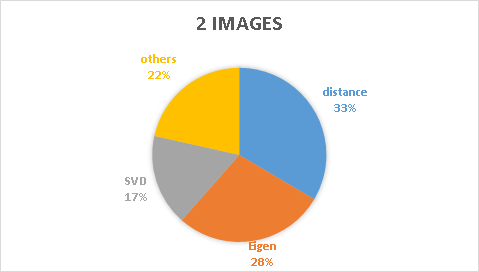
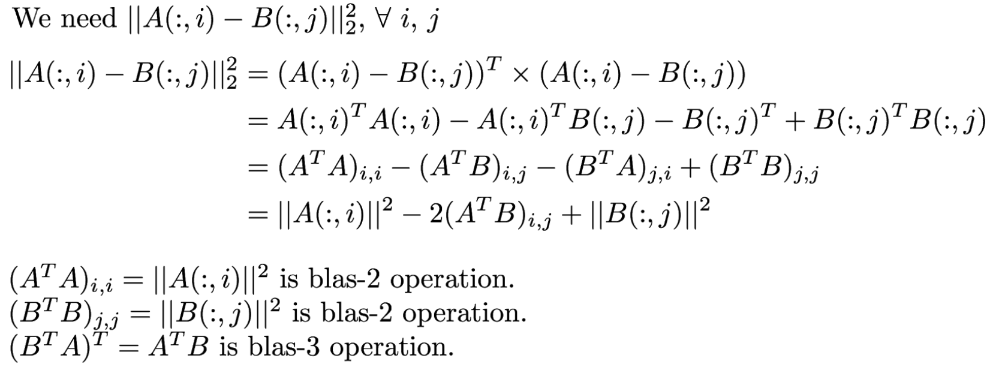
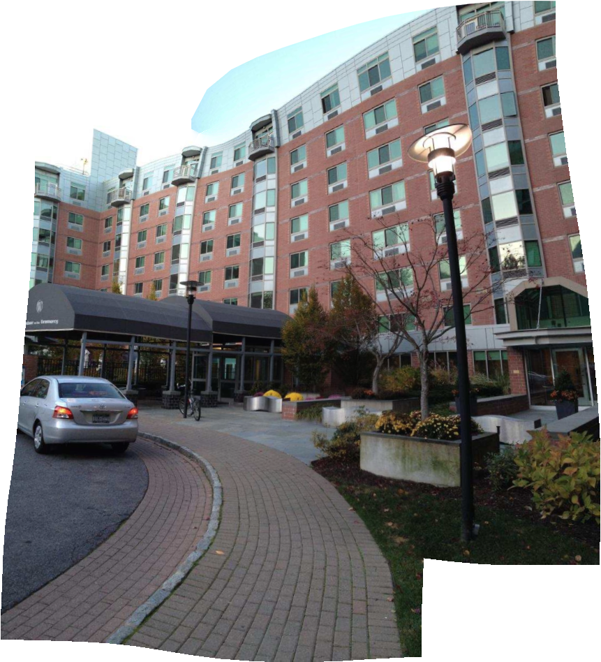
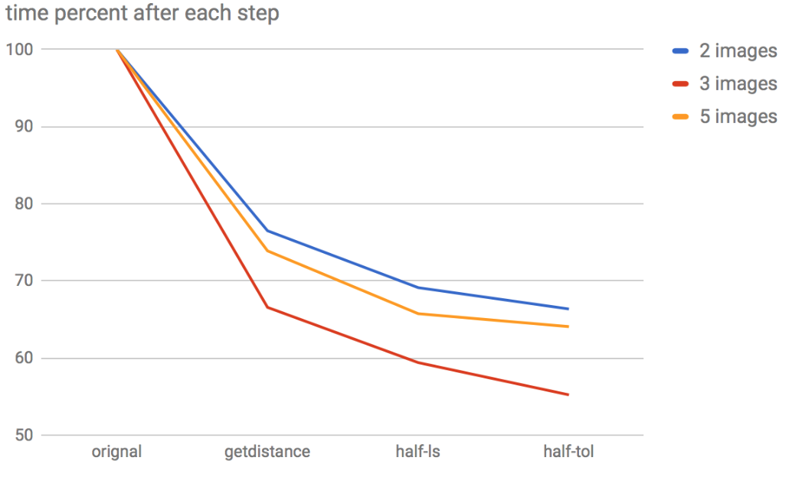
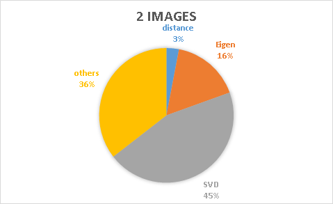

## GPU-accelerated Natural Image Stitching with Global Similarity Prior
This is the final project of 2017S GPGPU course. We follow this paper, Natural Image Stitching with Global Similarity Prior [1], and get its github source code[3]. We use GPU and change some settings to improve its performace.

## Profiling
We found the bottleneck of original version of image stitching are from three main part:
1. get feature pairs distance
2. least squares conjugate gradient solving
3. SVD

## Change the getdistance function on GPU
Orignal version calculate the distance of each pair. We use linear algebra to express the function. It can be done by blas-2 and blas-3 operations.

## Solve CG with initial guess
Original version use zero-initialization for iteration. We use vertices information as initial guess to accelerate the convergence of CG solving.
Below is the comparison between initial guess and zero-initialization under same iteration number.
Unfortunately, initial guess with vertices become worse when iteration carry on under same tolerance, it seems that this thought only applys when we terminates the iteration at early phase.

initial guess (150 iterations) |  zero initialization (150 iterations)
:-------------------------:|:-------------------------:
 | 

## Change other settings
We found the linear systems are same. It just use different blending. Thus, we reduce the number of linear system. Moreover, human eyes can't distinguish tiny details, so we use less tolarence = 1e-8 not 1e-16 to improve the performance.
## Results
After all improvement, we can use 55 ~ 65 % time of orignal version.
Each step contains those improving steps before it.

Below is the profiling after all improvement, we successfully reduce the timing of distance computing and CG solving by 30% and 12%.

## Future work
1. Change the orignal data structure. Make it store data as matrix not many short vectors.
2. Change the solver to make it run another case.
3. Improve the SVD algorithm

## More detail
There is our presentation slides : [google slide](https://goo.gl/pu3Eih)

## Author
Yuhsiang Tsai, Institute of Applied Mathematical Sciences, National Taiwan University (yhmtsai@gmail.com)
ChiaHo Lin, Institute of Electronics Engineering, National Taiwan University (chiahoo2004@gmail.com)

## Reference
- [1] Yu-Sheng Chen and Yung-Yu Chuang. “Natural Image Stitching with Global Similarity Prior.” Proceedings of European Conference on Computer Vision 2016 (ECCV 2016)
- [2] Zaragoza, J., Chin, T.J., Brown, M.S., Suter, D.: As-projective-as-possible image stitching with moving DLT. In: Proceedings of the 2013 IEEE Conference on Computer Vision and Pattern Recognition, CVPR 2013, pp. 2339–2346 (2013)
- [3] [github source](https://github.com/nothinglo/NISwGSP), C++ implementation of [1]
